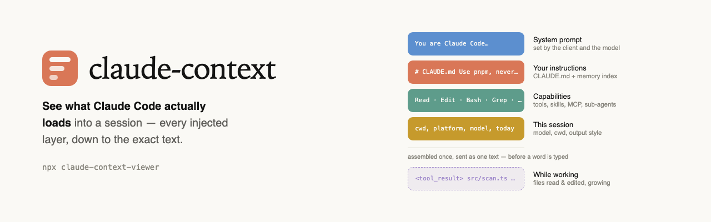
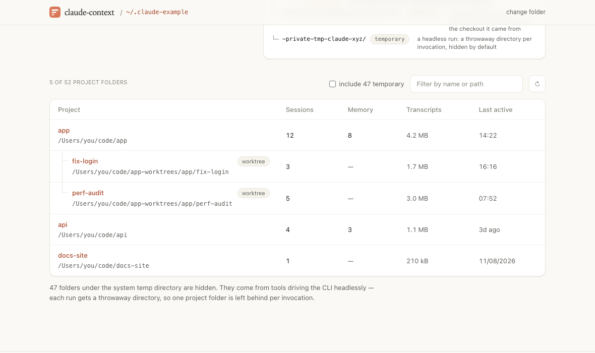

<p align="center">
  
</p>

# claude-context-viewer

**See what Claude Code actually loads into a session.** Every injected layer, per project and per
session, down to the exact text — and whether the auto-memory around it still holds together.


```bash
npx claude-context-viewer
```

[](docs/media/projects.png)

<sup>Screenshot taken against an example folder of invented projects.</sup>

## Why

`/context` in the terminal gives you a token total per layer, for the session you are sitting in.
This reads the transcripts on disk instead. So it works for any session, past or present, across
every project on the machine — and it shows the **contents** of each layer, not only its size.

Which answers questions the total cannot:

- **Why is my `CLAUDE.md` not being read?** A file that exists, holds nothing, and is never seen is
  a different problem from one that is missing. Only the two side by side tell you which you have.
- **What is my auto-memory costing me?** `MEMORY.md` is loaded whole on every single session. Its
  size is a fixed cost, and the page states it as one — in tokens, and per line.
- **Which memory is broken?** A `[[link]]` to a memory that was never written, a file with no line
  in the index, a `type:` written at the frontmatter root where it is read as no type at all.
- **What did that sub-agent read?** A sub-agent runs a context window of its own and only its final
  report comes back, so none of it lands in the session's figures. Its transcript is the only
  record, and it is sitting in the project folder.

## Install

Nothing to install:

```bash
npx claude-context-viewer
```

Or keep it around:

```bash
npm i -g claude-context-viewer
claude-context-viewer
```

It opens on `http://127.0.0.1:4700`. Node 20 or newer, no runtime dependencies, and nothing leaves
the machine.

```
Options
  -p, --port <n>      port to serve on (default: 4700)
      --host <host>   host to bind (default: 127.0.0.1)
  -h, --help          show this message
  -v, --version       show the version
```

Set `CLAUDE_CONFIG_DIR` to change which Claude folder it offers first; any other folder can be
picked in the page.

## What it shows

**Home.** A picker, and three short explainers with diagrams: how the system prompt is assembled
and sent as one text, how a conversation fills a finite window until the older turns are compacted,
and what a token is — including the rule this page uses to estimate them. The folder it opens on is
one of the Claude folders found on this machine (`~/.claude`, `CLAUDE_CONFIG_DIR`, any
`~/.claude-*` sibling) or one you name. The choice lives in the URL, so a link to a project
survives a reload and two tabs can hold two folders.

**Projects.** One folder per working directory Claude Code has run in — the screenshot above.
Worktrees are grouped under their checkout: a worktree gets its own transcripts but loads the
memory of the checkout it came from, and that is the only record of which, since the folder names
cannot say. A group is as recent as the most recent thing in it, so work in a worktree floats its
checkout up. The throwaway folders a headless run leaves behind sit behind a checkbox. And _last
active_ is read from the last record in the transcript rather than the file's date, which gets
touched by a session resumed without a word said.

**Instructions.** Every file that _can_ put instructions into a session here, next to whether it
ever did: the machine-wide `~/.claude/CLAUDE.md`, an organisation's managed settings, the
repository's `CLAUDE.md` and `CLAUDE.local.md`, the memory index, every subdirectory `CLAUDE.md`
— loaded only when Claude touches a file under it — and any `@import` they pull in. Each row opens
onto the file, rendered as Markdown or shown as source. A link inside one of these files is a path
on disk rather than a URL, so following one reads that path and shows it, `../../` and all. Only
paths inside the project or the Claude folder are served.

**Memory.** The files in `memory/`, their frontmatter, what each one costs, and what does not add
up: a `[[link]]` to a memory that was never written, a file with no line in `MEMORY.md`, an index
line pointing at a file that is gone, and eight ways a frontmatter can stop a file working — no
`---` block, no `name:` for a link to reach, a `name:` written as a sentence, a `name:` that
disagrees with the filename, no `description:`, a `type:` at the root instead of under `metadata:`,
no type, or one outside the four the instructions ask for. Style is deliberately left alone:
measured against a real folder of 77 memories, checking for the `**Why:**` and `**How to apply:**`
lines flagged more than half of them, which buries the faults that matter. A **Fix these** button
writes the repair up as a prompt to paste into Claude Code. This page never writes.

**Other files.** What the tabs above skip. A session that spawned sub-agents keeps their transcripts
in a subdirectory of its own; a tool result too large to sit inline is spilled to a file beside it;
workflow runs, published artifacts, hook output and the desktop app's own markers land there too.
Sub-agents are named by the type they ran as and what they were asked to do.

**Session layers.** The system prompt block by block, the `CLAUDE.md` and nested `CLAUDE.md` files,
the memory index, the tool and skill listings, the MCP instructions, the hooks that injected
context, the per-turn reminders, and everything the work itself dragged in: files read and edited,
directory listings, plans, queued prompts. Grouped, sorted by weight, expandable down to the exact
text. Startup context and what accumulated while working are counted separately.

## Where the data comes from

`~/.claude/projects/<slug>/<session>.jsonl`. Each session's `attachment` records are the layers,
and one of them — `prompt_snapshot` — holds the system prompt itself. Beside the transcripts sit
`memory/` and, for a session that needed them, a subdirectory of its own holding
`subagents/agent-*.jsonl`, `tool-results/`, `workflows/` and any artifact it published.

The page follows the folder while it is open: the server watches it and names the project folders
that changed, and only the matching data is read again. Nothing is polled, so an idle folder costs
one open connection and no work.

What it does not do is swap the page out from under you. The change is offered instead: the button
beside the project filter wakes up with a bar running across it, and the table takes the change in
when the bar runs out, or the moment you click. Idle it is disabled — and it says so plainly when
the folder cannot be watched at all, rather than reading as current while the page quietly stops
keeping up. Then the list moves rather than jumping: a folder that has just been worked in travels
up to where it now belongs, the rows it displaced follow in a wave, and a folder seen for the first
time fades in. All of it is skipped under `prefers-reduced-motion`.

## What it cannot tell you

Token counts are characters over four, and every total here is a lower bound. Two gaps are worth
knowing about before reading too much into a number.

- **The schemas of the tools on offer are not in the transcript.** The system prompt snapshot holds
  the prose blocks and no tool definitions at all — verified by searching it for parameter names.
  The capabilities group counts the listings, names and MCP instructions and sub-agent descriptions,
  rather than the schemas behind them, which in practice weigh more than everything else here.
- **Which individual memories were recalled is recorded nowhere.** The fixed cost of `MEMORY.md` is
  measurable; the memories that actually fired are not. They show up only when Claude opened one as
  a file, which lands in the runtime group like any other read.

Nothing is written. The server binds `127.0.0.1` and refuses cross-site requests, because
transcripts hold whatever was said and pasted into a session.

## Development

```bash
pnpm install
pnpm dev          # API from source on :4700, Vite on :4701
pnpm check        # lint, type-check, build
pnpm format       # prettier
```

The server is plain `node:http` with no framework; the page is React and Tailwind, with TanStack
Query for the reads. `src/server` reads the transcripts, `src/client` draws them, and `src/shared`
holds the types and the routes both ends agree on.

## Licence

MIT © Vincent Caudron

A personal tool, not affiliated with or endorsed by Anthropic.
